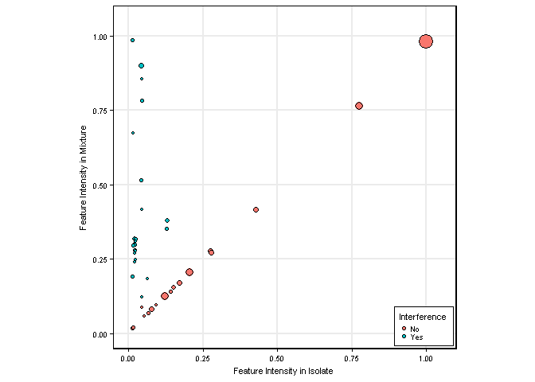

Insert Paper Title Here
================
William E Fondrie

Order of analysis (see the Rmd subdirectory for details):
1. [modelTraining.Rmd](%22Rmd/modelTraining.md%22)
2. [simulateComplexSpectra.Rmd](%22Rmd/simulateComplexSpectra.md%22)
3. [mixtureAnalysis.Rmd](%22Rmd/mixtureAnalysis.md%22)
4. [evaluateModels.Rmd](%22Rmd/evaluateModels.md%22)
5. [makeMiscFigures.Rmd](%22Rmd/makeMiscFigures.md%22)
6. [illustrations.Rmd](%22Rmd/illustrations.md%22)
7. [makeTables.Rmd](%22Rmd/makeTables.md%22)

Code to run the analysis
------------------------

### Prepare workspace

``` r
instPckgs <- F # change to "T" to install all packages used in the analyses

if(instPckgs) {
    install.packages(c("tidyverse",
                       "stringr",
                       "forcats",
                       "MALDIquant",
                       "MALDIquantForeign",
                       "caret",
                       "PRROC",
                       "xgboost",
                       "tictoc",
                       "devtools",
                       "openxlsx",
                       "knitr",
                       "rmarkdown"))
}

library(rmarkdown)
library(tictoc)

tic()

# Make results and temp directories:
dir.create("../temp")
dir.create("../results")

# Set global parameters for analysis
mzTol <- 1.5 # m/z tolerance for feature extraction in Da
saveRDS(mzTol, "../temp/mzTol.rds")
```

### Run Analysis Scripts

``` r
render("modelTraining.Rmd") # Trains xgboost models
render("simulateComplexSpectra.Rmd") # simulates polymicrobial spectra
render("mixtureAnalysis.Rmd") # Imports spectra from experimental two-species mixtures
render("evaluateModels.Rmd") # Calculate performance metrics and makes figures
```



``` r
render("makeMiscFigures.Rmd") # Creates additional figures
```


``` r
render("illustrations.Rmd") # Creates additional figures for illustrations
render("writeTables.Rmd") # Creates supplementarly Tables
```


### Copy .md files to top directory

``` r
file.copy("README.md", "..", overwrite=T)
```

Session Info
------------

``` r
times <- toc()

cat(c("Execution time:", round((times$toc - times$tic)/60, 0), "min\n\n"))

session_info()
```

    ## 41392.55 sec elapsed
    ## Execution time: 690 min
    ## 
    ##  setting  value                       
    ##  version  R version 3.4.0 (2017-04-21)
    ##  system   x86_64, mingw32             
    ##  ui       RTerm                       
    ##  language (EN)                        
    ##  collate  English_United States.1252  
    ##  tz       America/New_York            
    ##  date     2017-10-09                  
    ## 
    ##  package            * version  date       source        
    ##  assertthat           0.2.0    2017-04-11 CRAN (R 3.4.0)
    ##  backports            1.1.0    2017-05-22 CRAN (R 3.4.0)
    ##  base               * 3.4.0    2017-04-21 local         
    ##  base64enc            0.1-3    2015-07-28 CRAN (R 3.4.0)
    ##  bindr                0.1      2016-11-13 CRAN (R 3.4.1)
    ##  bindrcpp           * 0.2      2017-06-17 CRAN (R 3.4.1)
    ##  broom                0.4.2    2017-02-13 CRAN (R 3.4.0)
    ##  car                  2.1-5    2017-07-04 CRAN (R 3.4.1)
    ##  caret              * 6.0-76   2017-04-18 CRAN (R 3.4.0)
    ##  cellranger           1.1.0    2016-07-27 CRAN (R 3.4.0)
    ##  class                7.3-14   2015-08-30 CRAN (R 3.4.0)
    ##  codetools            0.2-15   2016-10-05 CRAN (R 3.4.0)
    ##  colorspace           1.3-2    2016-12-14 CRAN (R 3.4.0)
    ##  compiler             3.4.0    2017-04-21 local         
    ##  data.table           1.10.4   2017-02-01 CRAN (R 3.4.0)
    ##  datasets           * 3.4.0    2017-04-21 local         
    ##  devtools           * 1.13.2   2017-06-02 CRAN (R 3.4.1)
    ##  digest               0.6.12   2017-01-27 CRAN (R 3.4.0)
    ##  dplyr              * 0.7.2    2017-07-20 CRAN (R 3.4.1)
    ##  e1071                1.6-8    2017-02-02 CRAN (R 3.4.0)
    ##  evaluate             0.10.1   2017-06-24 CRAN (R 3.4.1)
    ##  forcats            * 0.2.0    2017-01-23 CRAN (R 3.4.0)
    ##  foreach              1.4.3    2015-10-13 CRAN (R 3.4.0)
    ##  foreign              0.8-69   2017-06-21 CRAN (R 3.4.0)
    ##  ggplot2            * 2.2.1    2016-12-30 CRAN (R 3.4.0)
    ##  glue                 1.1.1    2017-06-21 CRAN (R 3.4.1)
    ##  graphics           * 3.4.0    2017-04-21 local         
    ##  grDevices          * 3.4.0    2017-04-21 local         
    ##  grid                 3.4.0    2017-04-21 local         
    ##  gtable               0.2.0    2016-02-26 CRAN (R 3.4.0)
    ##  haven                1.1.0    2017-07-09 CRAN (R 3.4.1)
    ##  hms                  0.3      2016-11-22 CRAN (R 3.4.0)
    ##  htmltools            0.3.6    2017-04-28 CRAN (R 3.4.0)
    ##  httr                 1.2.1    2016-07-03 CRAN (R 3.4.0)
    ##  iterators            1.0.8    2015-10-13 CRAN (R 3.4.0)
    ##  jsonlite             1.5      2017-06-01 CRAN (R 3.4.1)
    ##  knitr                1.16     2017-05-18 CRAN (R 3.4.1)
    ##  labeling             0.3      2014-08-23 CRAN (R 3.4.0)
    ##  lattice            * 0.20-35  2017-03-25 CRAN (R 3.4.0)
    ##  lazyeval             0.2.0    2016-06-12 CRAN (R 3.4.0)
    ##  lme4                 1.1-13   2017-04-19 CRAN (R 3.4.0)
    ##  lubridate            1.6.0    2016-09-13 CRAN (R 3.4.0)
    ##  magrittr             1.5      2014-11-22 CRAN (R 3.4.0)
    ##  MALDIquant         * 1.16.2   2017-04-04 CRAN (R 3.4.0)
    ##  MALDIquantForeign  * 0.10     2015-11-01 CRAN (R 3.4.0)
    ##  MASS                 7.3-47   2017-02-26 CRAN (R 3.4.0)
    ##  Matrix               1.2-10   2017-04-28 CRAN (R 3.4.1)
    ##  MatrixModels         0.4-1    2015-08-22 CRAN (R 3.4.0)
    ##  memoise              1.1.0    2017-04-21 CRAN (R 3.4.1)
    ##  methods            * 3.4.0    2017-04-21 local         
    ##  mgcv                 1.8-17   2017-02-08 CRAN (R 3.4.0)
    ##  minqa                1.2.4    2014-10-09 CRAN (R 3.4.0)
    ##  mnormt               1.5-5    2016-10-15 CRAN (R 3.4.0)
    ##  ModelMetrics         1.1.0    2016-08-26 CRAN (R 3.4.0)
    ##  modelr               0.1.0    2016-08-31 CRAN (R 3.4.0)
    ##  munsell              0.4.3    2016-02-13 CRAN (R 3.4.0)
    ##  nlme                 3.1-131  2017-02-06 CRAN (R 3.4.0)
    ##  nloptr               1.0.4    2014-08-04 CRAN (R 3.4.0)
    ##  nnet                 7.3-12   2016-02-02 CRAN (R 3.4.0)
    ##  openxlsx           * 4.0.17   2017-03-23 CRAN (R 3.4.2)
    ##  parallel             3.4.0    2017-04-21 local         
    ##  pbkrtest             0.4-7    2017-03-15 CRAN (R 3.4.0)
    ##  pkgconfig            2.0.1    2017-03-21 CRAN (R 3.4.1)
    ##  plyr                 1.8.4    2016-06-08 CRAN (R 3.4.0)
    ##  PRROC              * 1.3      2017-04-21 CRAN (R 3.4.0)
    ##  psych                1.7.5    2017-05-03 CRAN (R 3.4.1)
    ##  purrr              * 0.2.2.2  2017-05-11 CRAN (R 3.4.1)
    ##  quantreg             5.33     2017-04-18 CRAN (R 3.4.0)
    ##  R6                   2.2.2    2017-06-17 CRAN (R 3.4.1)
    ##  Rcpp                 0.12.12  2017-07-15 CRAN (R 3.4.1)
    ##  readBrukerFlexData   1.8.5    2017-04-22 CRAN (R 3.4.0)
    ##  readMzXmlData        2.8.1    2015-09-16 CRAN (R 3.4.0)
    ##  readr              * 1.1.1    2017-05-16 CRAN (R 3.4.1)
    ##  readxl               1.0.0    2017-04-18 CRAN (R 3.4.0)
    ##  reshape2             1.4.2    2016-10-22 CRAN (R 3.4.0)
    ##  rlang                0.1.1    2017-05-18 CRAN (R 3.4.1)
    ##  rmarkdown          * 1.6      2017-06-15 CRAN (R 3.4.1)
    ##  rprojroot            1.2      2017-01-16 CRAN (R 3.4.0)
    ##  rstudioapi           0.6      2016-06-27 CRAN (R 3.4.1)
    ##  rvest                0.3.2    2016-06-17 CRAN (R 3.4.0)
    ##  scales               0.4.1    2016-11-09 CRAN (R 3.4.0)
    ##  SparseM              1.77     2017-04-23 CRAN (R 3.4.0)
    ##  splines              3.4.0    2017-04-21 local         
    ##  stats              * 3.4.0    2017-04-21 local         
    ##  stats4               3.4.0    2017-04-21 local         
    ##  stringi              1.1.5    2017-04-07 CRAN (R 3.4.0)
    ##  stringr            * 1.2.0    2017-02-18 CRAN (R 3.4.0)
    ##  tibble             * 1.3.3    2017-05-28 CRAN (R 3.4.1)
    ##  tictoc             * 1.0      2014-06-17 CRAN (R 3.4.0)
    ##  tidyr              * 0.6.3    2017-05-15 CRAN (R 3.4.1)
    ##  tidyverse          * 1.1.1    2017-01-27 CRAN (R 3.4.0)
    ##  tools                3.4.0    2017-04-21 local         
    ##  utils              * 3.4.0    2017-04-21 local         
    ##  withr                1.0.2    2016-06-20 CRAN (R 3.4.1)
    ##  xgboost            * 0.6-4    2017-01-05 CRAN (R 3.4.1)
    ##  XML                  3.98-1.9 2017-06-19 CRAN (R 3.4.0)
    ##  xml2                 1.1.1    2017-01-24 CRAN (R 3.4.0)
    ##  yaml                 2.1.14   2016-11-12 CRAN (R 3.4.0)
