Evaluate XGBoost Models
================
William E Fondrie

-   [Load Libraries & Prepare Workspace](#load-libraries-prepare-workspace)
-   [Evaluation of Model Performance on Isolate Spectra in Library](#evaluation-of-model-performance-on-isolate-spectra-in-library)
    -   [Acinetobacter baumannii](#acinetobacter-baumannii)
    -   [Klebsiella pneumoniae](#klebsiella-pneumoniae)
    -   [Plot PR and ROC Curves](#plot-pr-and-roc-curves)
-   [New Confusion Matrices](#new-confusion-matrices)
-   [Variable Importance](#variable-importance)
-   [Performance on Simulated Mixture Spectra](#performance-on-simulated-mixture-spectra)
    -   [Acinetobacter baumannii](#acinetobacter-baumannii-1)
    -   [Klebsiella pneumoniae](#klebsiella-pneumoniae-1)
    -   [Plot PR and ROC curves for Simulated Mixtures by Number of Spectra in Mixture](#plot-pr-and-roc-curves-for-simulated-mixtures-by-number-of-spectra-in-mixture)
    -   [Plot the AUC of PR and ROC Curves With Increasing Matrix Complexity](#plot-the-auc-of-pr-and-roc-curves-with-increasing-matrix-complexity)
-   [Two-Species UTI Mixtures](#two-species-uti-mixtures)
    -   [Plot scores vs cutoff](#plot-scores-vs-cutoff)
-   [Session Info](#session-info)

Load Libraries & Prepare Workspace
----------------------------------

``` r
# data manipulation
suppressMessages(library(tidyverse, quietly = T))
library(stringr, quietly = T)
library(forcats, quietly = T)

# machine learning tools
library(PRROC, quietly = T)
library(caret, quietly = T)
library(xgboost, quietly = T)

# for session info
library(devtools, quietly = T)

# ggplot2 theme
source("../R/ggplotTheme.R")
theme_set(coolTheme)

# other functions
source("../R/prepareData.R")
source("../R/utilityFunctions.R")

# for reproducibility
set.seed(0847532)
```

Evaluation of Model Performance on Isolate Spectra in Library
-------------------------------------------------------------

``` r
testList <- readRDS("../temp/testDatList.rds")
testdmatList <- prepareData(testList, orgLabs = c("Ab", "Kp"))

mods <- readRDS("../temp/finalModels.rds")

formatResults <- function(model, dataList) {
    results <- as.data.frame(predict(model, dataList$dat, reshape = T))
    names(results) <- levels(unique(dataList$encoding)[[1]])
    
    results <- results %>%
        mutate(truth = dataList$encoding[[1]],
               negVsAll = pos + other,
               posVsAll = neg + other,
               speciesVsOther = pos + neg,
               pred = ifelse(neg > pos & neg > other, "neg", NA),
               pred = ifelse(pos > neg & pos > other, "pos", pred),
               pred = ifelse(other > neg & other > pos, "other", pred))
    
    return(results)
}
```

### Acinetobacter baumannii

``` r
abMod <- xgb.load(mods$Ab)
abRes <- formatResults(abMod, testdmatList$Ab)

# Ab PR curves
abPosPR <- pr.curve(abRes$pos[abRes$truth == "pos"], 
                    abRes$pos[abRes$truth != "pos"], curve = T)

abSpeciesPR <- pr.curve(abRes$speciesVsOther[abRes$truth != "other"], 
                        abRes$speciesVsOther[abRes$truth ==  "other"], curve = T)

# Ab ROC curves
abPosROC <- roc.curve(abRes$pos[abRes$truth == "pos"], 
                    abRes$pos[abRes$truth != "pos"], curve = T)

abSpeciesROC <- roc.curve(abRes$speciesVsOther[abRes$truth != "other"], 
                        abRes$speciesVsOther[abRes$truth ==  "other"], curve = T)

saveRDS(abRes, file = "../temp/abRes.rds")
```

### Klebsiella pneumoniae

``` r
kpMod <- xgb.load(mods$Kp)
kpRes <- formatResults(kpMod, testdmatList$Kp)

# Kp PR curves
kpPosPR <- pr.curve(kpRes$pos[kpRes$truth == "pos"], 
                    kpRes$pos[kpRes$truth != "pos"], curve = T)

kpSpeciesPR <- pr.curve(kpRes$speciesVsOther[kpRes$truth != "other"], 
                        kpRes$speciesVsOther[kpRes$truth ==  "other"], curve = T)

# Kp ROC curves
kpPosROC <- roc.curve(kpRes$pos[kpRes$truth == "pos"], 
                    kpRes$pos[kpRes$truth != "pos"], curve = T)

kpSpeciesROC <- roc.curve(kpRes$speciesVsOther[kpRes$truth != "other"], 
                        kpRes$speciesVsOther[kpRes$truth ==  "other"], curve = T)

saveRDS(kpRes, file = "../temp/kpRes.rds")
```

### Plot PR and ROC Curves

#### Acinetobacter PR & ROC Curves

``` r
# PR
prnames <- c("Recall", "Precision", "threshold")
prAb <- as.tibble(rbind(abPosPR$curve, abSpeciesPR$curve))
names(prAb) <- prnames

labsAb <- c(paste0("Resistant\nAUC = ", sigRound(abPosPR$auc.integral, 3)),
            paste0("Species\nAUC = ", sigRound(abSpeciesPR$auc.integral, 3)))

AbPrCurve <- prAb %>%
    mutate(cond = c(rep(labsAb[1], nrow(abPosPR$curve)),
                    rep(labsAb[2], nrow(abSpeciesPR$curve))),
           cond = fct_rev(fct_relevel(as.factor(cond), labsAb))) %>%
    ggplot(aes(x = Recall, y = Precision, color = cond)) +
    geom_path(size = 1)  +
    coord_equal() +
    ylim(c(0, 1)) +
    xlim(c(0, 1)) +
    theme(legend.title = element_blank(),
          legend.key.height = unit(1.2, "lines"),
          legend.key.width = unit(0.6, "lines"),
          legend.margin = margin(l = -0.5, unit = "lines"),
          plot.title = element_text(margin = margin(b = 0.5, unit = "lines"))) +
    ggtitle(expression(italic("A. baumannii")))

AbPrCurve
```

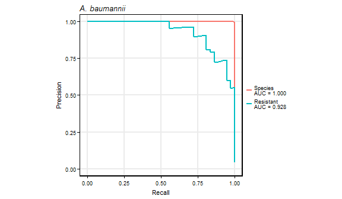

``` r
ggsave("../results/AbPrCurve.pdf", width = 70, height = 50, units = "mm", useDingbats = F)

# ROC
rocnames <- c("1 - Specificity (FPR)", "Sensitivity (TPR)", "threshold")
rocAb <- as.tibble(rbind(abPosROC$curve, 
                         abSpeciesROC$curve))
names(rocAb) <- rocnames

roclabsAb <- c(paste0("Resistant\nAUC = ", sigRound(abPosROC$auc, 3)),
               paste0("Species\nAUC = ", sigRound(abSpeciesROC$auc, 3)))


AbRocCurve <- rocAb %>%
    mutate(cond = c(rep(roclabsAb[1], nrow(abPosROC$curve)),
                    rep(roclabsAb[2], nrow(abSpeciesROC$curve))),
           cond = fct_rev(fct_relevel(as.factor(cond), roclabsAb))) %>%
    ggplot(aes(x = `1 - Specificity (FPR)`, y = `Sensitivity (TPR)`, color = cond)) +
    geom_abline(xintercept = 0, slope = 1) +
    geom_path(size = 1) +
    ylim(c(0, 1)) +
    xlim(c(0, 1)) +
    coord_equal() +
    theme(legend.title = element_blank(),
          legend.key.height = unit(1.2, "lines"),
          legend.key.width = unit(0.6, "lines"),
          legend.margin = margin(l = -0.5, unit = "lines"),
          plot.title = element_text(margin = margin(b = 0.5, unit = "lines"))) +
    ggtitle(expression(italic("A. baumannii")))

AbRocCurve
```

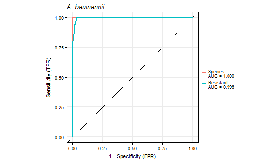

``` r
ggsave("../results/AbRocCurve.pdf", width = 70, height = 50, units = "mm", useDingbats = F)
```

#### Klebsiella pneumoniae PR & ROC Curves

``` r
# PR
prnames <- c("Recall", "Precision", "threshold")
prKp <- as.tibble(rbind(kpPosPR$curve, 
                        kpSpeciesPR$curve))
names(prKp) <- prnames

labsKp <- c(paste0("Resistant\nAUC = ", sigRound(kpPosPR$auc.integral, 3)),
            paste0("Species\nAUC = ", sigRound(kpSpeciesPR$auc.integral, 3)))

prKp %>%
    mutate(cond = c(rep(labsKp[1], nrow(kpPosPR$curve)),
                    rep(labsKp[2], nrow(kpSpeciesPR$curve))),
           cond = fct_rev(fct_relevel(as.factor(cond), labsKp))) %>%
    ggplot(aes(x = Recall, y = Precision, color = cond)) +
    geom_path(size = 1)  +
    ylim(c(0, 1)) +
    xlim(c(0, 1)) +
    coord_equal() +
    theme(legend.title = element_blank(),
          legend.key.height = unit(1.2, "lines"),
          legend.key.width = unit(0.6, "lines"),
          legend.margin = margin(l = -0.5, unit = "lines"),
          plot.title = element_text(margin = margin(b = -0, unit = "lines"))) +
    ggtitle(expression(italic("K. pneumoniae")))
```

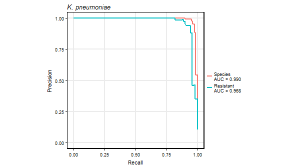

``` r
ggsave("../results/KpPrCurve.pdf", width = 70, height = 50, units = "mm", useDingbats = F)

# ROC
rocnames <- c("1 - Specificity (FPR)", "Sensitivity (TPR)", "threshold")
```


``` r
rocKp <- as.tibble(rbind(kpPosROC$curve, 
                         kpSpeciesROC$curve))
names(rocKp) <- rocnames

roclabsKp <- c(paste0("Resistant\nAUC = ", sigRound(kpPosROC$auc, 3)),
               paste0("Species\nAUC = ", sigRound(kpSpeciesROC$auc, 3)))

rocKp %>%
    mutate(cond = c(rep(roclabsKp[1], nrow(kpPosROC$curve)),
                    rep(roclabsKp[2], nrow(kpSpeciesROC$curve))),
           cond = fct_rev(fct_relevel(as.factor(cond), roclabsKp))) %>%
    ggplot(aes(x = `1 - Specificity (FPR)`, y = `Sensitivity (TPR)`, color = cond)) +
    geom_abline(xintercept = 0, slope = 1) +
    geom_path(size = 1) +
    ylim(c(0, 1)) +
    xlim(c(0, 1)) +
    coord_equal() + 
    theme(legend.title = element_blank(),
          legend.key.height = unit(1.2, "lines"),
          legend.key.width = unit(0.6, "lines"),
          legend.margin = margin(l = -0.5, unit = "lines"),
          plot.title = element_text(margin = margin(b = 0, unit = "lines"))) +
    ggtitle(expression(italic("K. pneumoniae")))
```

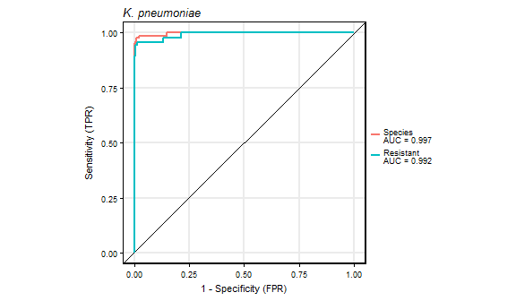

``` r
ggsave("../results/KpRocCurve.pdf", width = 70, height = 50, units = "mm", useDingbats = F)
```

New Confusion Matrices
----------------------

``` r
pickThold <- function(curve, minSens) {
    dat <- as.data.frame(curve$curve)
    dat <- dat[dat[ , 2] >= minSens, ]
    dat <- dat[dat[ , 3] == max(dat[ , 3]), ]
    names(dat) <- c("FPR", "TPR", "threshold")
    
    return(dat)
} 

thold <- tibble(type = c("Ab_species", "Ab_resistant","Kp_species", "Kp_resistant"),
                curves = list(abSpeciesROC, abPosROC, kpSpeciesROC, kpPosROC)) %>%
    group_by(type) %>%
    do(pickThold(curve = .$curves[[1]], 0.97))

abRes2 <- abRes %>% 
    mutate(posPred = ifelse(pos >= thold$threshold[thold$type == "Ab_resistant"],
                            "pos", "neg"),
           posTruth = ifelse(truth == "pos", "pos", "neg"),
           specPred = ifelse(speciesVsOther >= thold$threshold[thold$type == "Ab_species"],
                              "Ab", "other"),
           specTruth = ifelse(truth != "other", "Ab", "other"))

# Ab Species
confusionMatrix(data = abRes2$specPred, reference = abRes2$specTruth, 
                positive = "Ab", mode = "everything")

# Colistin-Resistant Ab
confusionMatrix(data = abRes2$posPred, reference = abRes2$posTruth, 
                positive = "pos", mode = "everything")


kpRes2 <- kpRes %>%
    mutate(posPred = ifelse(pos >= thold$threshold[thold$type == "Kp_resistant"],
                            "pos", "neg"),
           posTruth = ifelse(truth == "pos", "pos", "neg"),
           specPred = ifelse(speciesVsOther >= thold$threshold[thold$type == "Kp_species"],
                             "Kp", "other"),
           specTruth = ifelse(truth != "other", "Kp", "other"))

# Kp Species
confusionMatrix(data = kpRes2$specPred, reference = kpRes2$specTruth, 
                positive = "Kp", mode = "everything")

# Colistin-Resistant Kp
confusionMatrix(data = kpRes2$posPred, reference = kpRes2$posTruth, 
                positive = "pos", mode = "everything")
```

Variable Importance
-------------------

``` r
vImpAb <- xgb.importance(colnames(testdmatList$Ab$dat), model = abMod) %>%
    mutate(org = "Ab")

vImpKp <- xgb.importance(colnames(testdmatList$Kp$dat), model = kpMod) %>%
    mutate(org = "Kp")

basePeaks <- c("1912.5448", # Ab
               "1841.4497", # Kp
               "1826.3531",
               "2080.3158")
resPeaks <- c("2036.4927", # Ab
              "1957.0536",
              "1957.1088", # Kp
              "1973.1961",
              "1895.7716")

vImp <- vImpAb %>%
    full_join(vImpKp) %>%
    mutate(featureMz = as.factor(str_replace(Feature, "mz", "")),
           featureMz = fct_reorder(featureMz, Gain, .desc = T),
           color = ifelse(featureMz %in% basePeaks, "Base Lipid A Structure", NA),
           color = ifelse(featureMz %in% resPeaks, "Resistance Lipid A Structure", color)) %>%
    group_by(org) %>%
    arrange(desc(Gain)) %>%
    filter(Gain >= Gain[20])

# Acinetobacter
vImp %>%
    filter(org == "Ab") %>%
    ggplot(aes(x = featureMz, y = Gain, ymax = Gain, ymin = 0)) +
    geom_linerange(size = 0.75) +
    geom_point(size = 2, aes(color = color)) +
    xlab(expression(paste("Feature (", italic("m/z"), ")"))) +
    scale_color_discrete(breaks = c("Base Lipid A Structure", "Resistance Lipid A Structure")) +
    theme(axis.text.x = element_text(angle = 45, hjust = 1, vjust = 1),
          legend.position = c(0.996, 0.992),
          legend.justification = c(1, 1),
          legend.title = element_blank(),
          legend.background = element_rect(color = "black"),
          legend.key.size = unit(0.5, "lines"),
          legend.margin = margin(t = 0, b = 0.2, l = 0.2, r = 0.2,  unit = "lines"),
          plot.title = element_text(margin = margin(b = 0.5, unit = "lines"))) +
    ggtitle(expression(italic("A. baumannii")))
```

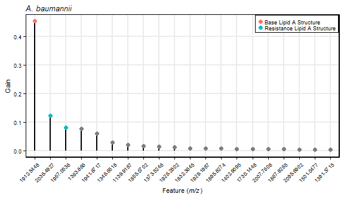

``` r
ggsave("../results/vImpAbPlot.pdf", width = 70, height = 50, units = "mm", useDingbats = F)

saveRDS(vImpAb, "../temp/vImpAb.rds")
```


``` r
# Klebsiella
vImp %>%
    filter(org == "Kp") %>%
    ggplot(aes(x = featureMz, y = Gain, ymax = Gain, ymin = 0)) +
    geom_linerange(size = 0.75) +
    geom_point(size = 2, aes(color = color)) +
    xlab(expression(paste("Feature (", italic("m/z"), ")"))) +
    scale_color_discrete(breaks = c("Base Lipid A Structure", "Resistance Lipid A Structure")) +
    theme(axis.text.x = element_text(angle = 45, hjust = 1, vjust = 1),
          legend.position = c(0.996, 0.992),
          legend.justification = c(1, 1),
          legend.title = element_blank(),
          legend.background = element_rect(color = "black"),
          legend.key.size = unit(0.5, "lines"),
          legend.margin = margin(t = 0, b = 0.2, l = 0.2, r = 0.2,  unit = "lines"),
          plot.title = element_text(margin = margin(b = 0, unit = "lines"))) +
    ggtitle(expression(italic("K. pneumoniae")))
```

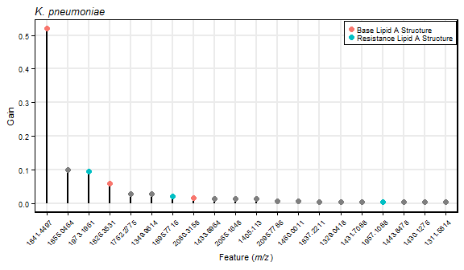

``` r
ggsave("../results/vImpKpPlot.pdf", width = 70, height = 50, units = "mm", useDingbats = F)

saveRDS(vImpKp, "../temp/vImpKp.rds")
```

Performance on Simulated Mixture Spectra
----------------------------------------

``` r
# Import simulated mixture spectra features and information
mixedSumm <- readRDS("../temp/complexSpectraSummary.rds")
mixedComponents <- readRDS("../temp/complexComponents.rds")

mixedList <- readRDS("../temp/mixtureDatList.rds")

mixedDmatList <- prepareData(mixedList, orgLabs = c("Ab", "Kp"))
```

### Acinetobacter baumannii

``` r
mixedAbRes <- formatResults(abMod, mixedDmatList$Ab) %>%
    cbind(., mixedList$Ab) %>%
    select(-starts_with("mz")) %>%
    mutate(orgResults = "A. baumannii") %>%
    as_tibble(.)

mixedAbPRall <- mixedAbRes %>%
    group_by(orgResults) %>%
    do(prPos = pr.curve(.$pos[.$truth == "pos"], .$pos[.$truth != "pos"], curve = T),
       prSpecies = pr.curve(.$speciesVsOther[.$truth != "other"], 
                            .$speciesVsOther[.$truth ==  "other"], curve = T),
       rocPos = roc.curve(.$pos[.$truth == "pos"], .$pos[.$truth != "pos"], curve = T),
       rocSpecies = roc.curve(.$speciesVsOther[.$truth != "other"], 
                            .$speciesVsOther[.$truth ==  "other"], curve = T)) %>%
    mutate(prPosAUC = prPos$auc.integral,
           prSpeciesAUC = prSpecies$auc.integral,
           rocPosAUC = rocPos$auc,
           rocSpeciesAUC = rocSpecies$auc,
           n = "Overall")

mixedAbPRByn <- mixedAbRes %>%
    group_by(orgResults, n) %>%
    do(prPos = pr.curve(.$pos[.$truth == "pos"], .$pos[.$truth != "pos"], curve = T),
       prSpecies = pr.curve(.$speciesVsOther[.$truth != "other"], 
                            .$speciesVsOther[.$truth ==  "other"], curve = T),
       rocPos = roc.curve(.$pos[.$truth == "pos"], .$pos[.$truth != "pos"], curve = T),
       rocSpecies = roc.curve(.$speciesVsOther[.$truth != "other"], 
                            .$speciesVsOther[.$truth ==  "other"], curve = T)) %>%
    mutate(prPosAUC = prPos$auc.integral,
           prSpeciesAUC = prSpecies$auc.integral,
           rocPosAUC = rocPos$auc,
           rocSpeciesAUC = rocSpecies$auc)

mixedAbCurves <- mixedAbPRall %>% rbind(mixedAbPRByn)

saveRDS(mixedAbRes, file = "../temp/mixedAbRes.rds")
```

### Klebsiella pneumoniae

``` r
mixedKpRes <- formatResults(kpMod, mixedDmatList$Kp) %>%
    cbind(., mixedList$Kp) %>%
    select(-starts_with("mz"))%>%
    mutate(orgResults = "K. pneumoniae") %>%
    as_tibble(.)

mixedKpAll <- mixedKpRes %>%
    group_by(orgResults) %>%
    do(prPos = pr.curve(.$pos[.$truth == "pos"], .$pos[.$truth != "pos"], curve = T),
       prSpecies = pr.curve(.$speciesVsOther[.$truth != "other"], 
                            .$speciesVsOther[.$truth ==  "other"], curve = T),
       rocPos = roc.curve(.$pos[.$truth == "pos"], .$pos[.$truth != "pos"], curve = T),
       rocSpecies = roc.curve(.$speciesVsOther[.$truth != "other"], 
                            .$speciesVsOther[.$truth ==  "other"], curve = T)) %>%
    mutate(prPosAUC = prPos$auc.integral,
           prSpeciesAUC = prSpecies$auc.integral,
           rocPosAUC = rocPos$auc,
           rocSpeciesAUC = rocSpecies$auc,
           n = "Overall")

mixedKpByn <- mixedKpRes %>%
    group_by(orgResults, n) %>%
    do(prPos = pr.curve(.$pos[.$truth == "pos"], .$pos[.$truth != "pos"], curve = T),
       prSpecies = pr.curve(.$speciesVsOther[.$truth != "other"], 
                            .$speciesVsOther[.$truth ==  "other"], curve = T),
       rocPos = roc.curve(.$pos[.$truth == "pos"], .$pos[.$truth != "pos"], curve = T),
       rocSpecies = roc.curve(.$speciesVsOther[.$truth != "other"], 
                            .$speciesVsOther[.$truth ==  "other"], curve = T)) %>%
    mutate(prPosAUC = prPos$auc.integral,
           prSpeciesAUC = prSpecies$auc.integral,
           rocPosAUC = rocPos$auc,
           rocSpeciesAUC = rocSpecies$auc)

mixedKpCurves <- mixedKpAll %>% rbind(mixedKpByn)

# All PR and ROC results
mixedCurves <- mixedKpCurves %>% rbind(mixedAbCurves)

saveRDS(mixedKpRes, file = "../temp/mixedKpRes.rds")
```

### Plot PR and ROC curves for Simulated Mixtures by Number of Spectra in Mixture

``` r
mixedCurveDat <- mixedCurves %>%
    select(-ends_with("AUC")) %>%
    gather(curveType, curveDat, -n, -orgResults) %>%
    group_by(orgResults, n, curveType) %>% 
    do(curveDf = as_tibble(.$curveDat[[1]]$curve)) %>%
    ungroup() %>%
    unnest(curveDf) %>%
    rename("Rec_Spec" = V1, "Prec_Sens" = V2, "Threshold" = V3) %>%
    mutate(PrOrRoc = ifelse(str_detect(curveType, "pr"), "PR", "ROC"),
           type = ifelse(str_detect(curveType, "Pos"), "Colistin-Resistant", "Species"), #type),
           type = as.factor(type))

mixedCurveDat %>%
    filter(PrOrRoc == "PR") %>%
    ggplot(aes(x = Rec_Spec, y = Prec_Sens, color = n)) +
    geom_path() +
    coord_equal() +
    facet_grid(orgResults ~ type) +
    xlab("Recall") +
    ylab("Precision") +
    ylim(0, 1) +
    xlim(0, 1) +
    scale_color_discrete(name = "Number of Species") +
    theme(legend.key.size = unit(0.75, "lines"),
          legend.margin = margin(t = -0.5, unit = "lines"),
          legend.position = "bottom",
          axis.text.x = element_text(angle = 30, hjust = 1, vjust = 1))
```

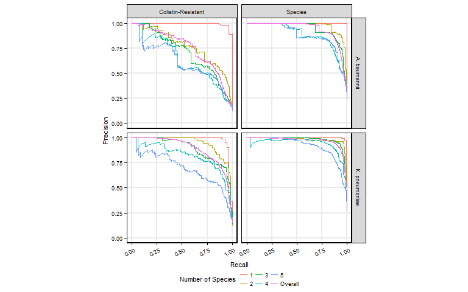

``` r
ggsave("../results/mixturePRCurves.pdf", width = 70, height = 80, units = "mm", useDingbats = F)


mixedCurveDat %>%
    filter(PrOrRoc == "ROC") %>%
    ggplot(aes(x = Rec_Spec, y = Prec_Sens, color = n)) +
    geom_abline(xintercept = 0, slope = 1) +
    geom_path() +
    coord_equal() +
    facet_grid(orgResults ~ type) +
    xlab("1 - Specificity (FPR)") +
    ylab("Sensitivity (TPR)") +
    ylim(0, 1) +
    xlim(0, 1) +
    scale_color_discrete(name = "Number of Species") +
    theme(legend.key.size = unit(0.75, "lines"),
          legend.margin = margin(t = -0.5, unit = "lines"),
          legend.position = "bottom",
          axis.text.x = element_text(angle = 30, hjust = 1, vjust = 1))
```

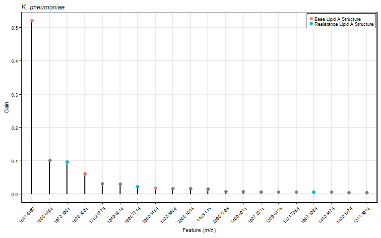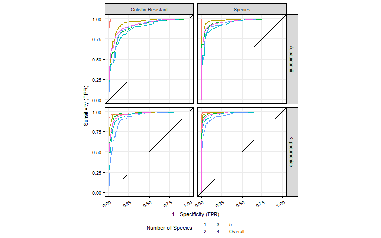

``` r
ggsave("../results/mixtureROCCurves.pdf", width = 70, height = 80, units = "mm", useDingbats = F)
```

### Plot the AUC of PR and ROC Curves With Increasing Matrix Complexity

``` r
labOrder <- c("Species", 
              "Colistin-Resistant")

mixedCurvesAUC <- mixedCurves %>%
    select(ends_with("AUC"), n, orgResults) %>%
    gather(curveType, AUC, -n, -orgResults) %>%
    mutate(PrOrRoc = ifelse(str_detect(curveType, "pr"), "PR", "ROC"),
           type = ifelse(str_detect(curveType, "Neg"), "Colistin-Susceptible", "Species"),
           type = ifelse(str_detect(curveType, "Pos"), "Colistin-Resistant", type),
           type = fct_relevel(as.factor(type), labOrder))

mixedCurvesAUC %>%
    filter(n != "Otherwise") %>%
    ggplot(aes(x = as.numeric(n), y = AUC, color = type)) +
    geom_line() +
    geom_point() + 
    xlab("Number of Species in Mixture") +
    ylab("Area Under the Curve") +
    ylim(c(0, 1)) +
    coord_fixed(ratio = 4) +
    scale_color_discrete(name = NULL) +
    facet_grid(fct_rev(PrOrRoc) ~ orgResults) +
    theme(legend.key.size = unit(0.75, "lines"),
          legend.margin = margin(t = -0.5, unit = "lines"),
          legend.position = "bottom")
```

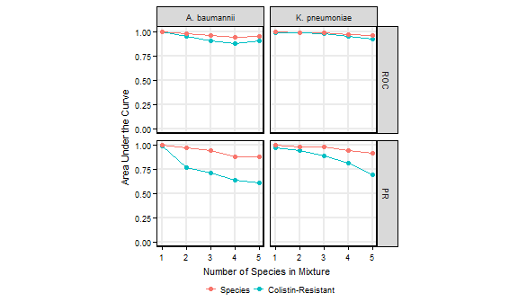

``` r
ggsave("../results/mixedCurvesAUCPlot.pdf", width = 70, height = 80, units = "mm", useDingbats = F)
```

``` r
mixedAbRes <- mixedAbRes %>%
    mutate(posPred = ifelse(pos >= thold$threshold[thold$type == "Ab_resistant"],
                            "pos", "neg"),
           posTruth = ifelse(truth == "pos", "pos", "neg"),
           specPred = ifelse(speciesVsOther >= thold$threshold[thold$type == "Ab_species"],
                             "Ab", "other"),
           specTruth = ifelse(truth != "other", "Ab", "other"))


mixedKpRes <- mixedKpRes %>%
    mutate(posPred = ifelse(pos >= thold$threshold[thold$type == "Kp_resistant"],
                            "pos", "neg"),
           posTruth = ifelse(truth == "pos", "pos", "neg"),
           specPred = ifelse(speciesVsOther >= thold$threshold[thold$type == "Kp_species"],
                             "Kp", "other"),
           specTruth = ifelse(truth != "other", "Kp", "other"))


specStats <- function(resDf, posClass) {
    d1 <- map_df(1:5, function(n) {
        cm <- confusionMatrix(data = resDf$specPred[resDf$n == n], 
                              reference = resDf$specTruth[resDf$n == n], 
                              positive = posClass, mode = "everything")
        
        data.frame(as.list(c(cm$overall, cm$byClass)))
    })
    
    cm2 <- confusionMatrix(data = resDf$specPred, 
                           reference = resDf$specTruth, 
                           positive = posClass, mode = "everything")
    
    ret <- rbind(data.frame(as.list(c(cm2$overall, cm2$byClass))), d1)
    ret$n <- c("Overall", 1, 2, 3, 4, 5)
    
    return(ret)
}

# Ab Species
specStats(mixedAbRes, "Ab")

# Kp Species
specStats(mixedKpRes, "Kp")


resStats <- function(resDf, posClass = "pos") {
    d1 <- map_df(1:5, function(n) {
        cm <- confusionMatrix(data = resDf$posPred[resDf$n == n], 
                              reference = resDf$posTruth[resDf$n == n], 
                              positive = posClass, mode = "everything")
        
        data.frame(as.list(c(cm$overall, cm$byClass)))
    })
    
    cm2 <- confusionMatrix(data = resDf$posPred, 
                           reference = resDf$posTruth, 
                           positive = posClass, mode = "everything")
    
    ret <- rbind(data.frame(as.list(c(cm2$overall, cm2$byClass))), d1)
    ret$n <- c("Overall", 1, 2, 3, 4, 5)
    
    return(ret)
}

# Ab Species
resStats(mixedAbRes)

# Kp Species
resStats(mixedKpRes)
```

Two-Species UTI Mixtures
------------------------

``` r
# Import simulated mixture spectra features and information
twoSpeciesSumm <- readRDS("../temp/twoSpeciesSpecInfo.rds")

twoSpeciesList <- readRDS("../temp/twoSpeciesDatList.rds")

twoSpeciesDmatList <- prepareData(twoSpeciesList, orgLabs = c("Ab", "Kp"))

# predict 
twoAbRes <- formatResults(abMod, twoSpeciesDmatList$Ab) %>%
    cbind(., twoSpeciesList$Ab) %>%
    select(-starts_with("mz"))%>%
    mutate(orgResults = "A. baumannii",
           percentTarget = ifelse(truth == "other", 0, 100 - percentEc),
           Colistin = ifelse(percentTarget > 0 & truth != "other", as.character(truth), NA),
           Colistin = str_replace(Colistin, "pos", "resistant"),
           Colistin = str_replace(Colistin, "neg", "susceptible")) %>%
    as_tibble(.)

twoKpRes <- formatResults(kpMod, twoSpeciesDmatList$Kp) %>%
    cbind(., twoSpeciesList$Kp) %>%
    select(-starts_with("mz"))%>%
    mutate(orgResults = "K. pneumoniae",
           percentTarget = ifelse(truth == "other", 0, 100 - percentEc),
           Colistin = ifelse(percentTarget > 0 & truth != "other", as.character(truth), NA),
           Colistin = str_replace(Colistin, "pos", "resistant"),
           Colistin = str_replace(Colistin, "neg", "susceptible")) %>%
    as_tibble(.)


twoRes <- twoAbRes %>% 
    full_join(twoKpRes) %>%
    mutate(Colistin = fct_rev(as.factor(Colistin))) %>%
    filter(!(truth == "other" & percentEc != 100))

saveRDS(twoAbRes, file = "../temp/twoAbRes.rds")
saveRDS(twoKpRes, file = "../temp/twoKpRes.rds")
```

### Plot scores vs cutoff

``` r
tholdSpecies <- thold %>%
    filter(str_detect(type, "species")) %>%
    mutate(orgResults = ifelse(str_detect(type, "Ab"),
                               "A. baumannii",
                               "K. pneumoniae"))

twoRes %>%
    ggplot(aes(x = as.factor(percentTarget), y = speciesVsOther, fill = Colistin)) +
    geom_hline(data = tholdSpecies, aes(yintercept = threshold), 
               size = 1, linetype = "dashed") +
    geom_jitter(width = 0.25, shape = 21) +
    facet_wrap(~orgResults, ncol = 2) +
    scale_fill_discrete(breaks = c("resistant", "susceptible")) +
    xlab("Percent Target Species by Volume") +
    ylab("Species Score") +
    theme(legend.key.size = unit(0.75, "lines"),
          legend.margin = margin(t = -0.5, unit = "lines"),
          legend.position = "bottom") +
    ylim(c(0, 1))
```

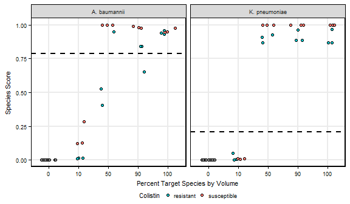

``` r
ggsave("../results/twoSpeciesSpecRes.pdf", width = 105, height = 60, units = "mm", useDingbats = F)


tholdRes <- thold %>%
    filter(str_detect(type, "res")) %>%
    mutate(orgResults = ifelse(str_detect(type, "Ab"),
                               "A. baumannii",
                               "K. pneumoniae"))
```

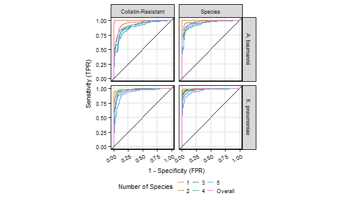

``` r
twoRes %>%
    ggplot(aes(x = as.factor(percentTarget), y = pos, fill = Colistin)) +
    geom_hline(data = tholdRes, aes(yintercept = threshold), 
               size = 1, linetype = "dashed") +
    geom_jitter(width = 0.25, shape = 21) +
    facet_wrap(~orgResults, ncol = 2) +
    scale_fill_discrete(breaks = c("resistant", "susceptible")) +
    xlab("Percent Target Species by Volume") +
    ylab("Colistin-Resistance Score") +
    theme(legend.key.size = unit(0.75, "lines"),
          legend.margin = margin(t = -0.5, unit = "lines"),
          legend.position = "bottom") +
    ylim(c(0, 1))
```

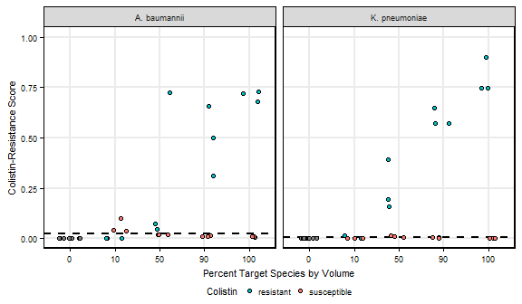

``` r
ggsave("../results/twoSpeciesResRes.pdf", width = 105, height = 60, units = "mm", useDingbats = F)
```

Session Info
------------

``` r
session_info()
```
